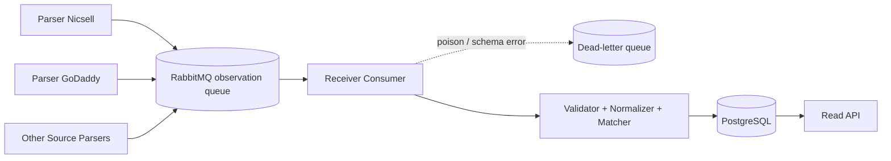
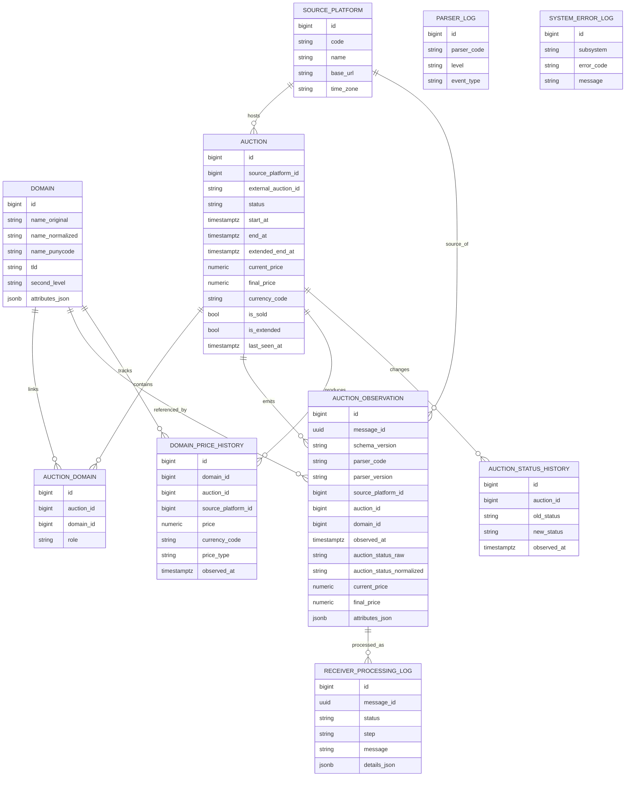
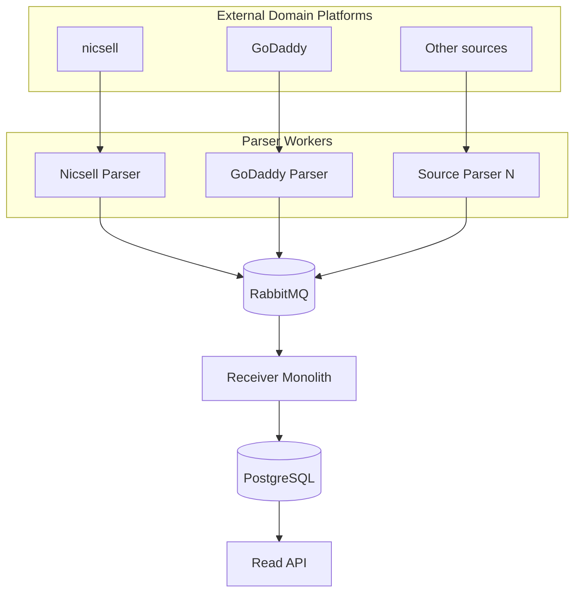

# Аналитический отчёт по проекту платформы сбора и анализа данных по торгам доменов

## Executive summary

В приложенном ТЗ раздел `0.1 Обязательные доработки` **не отсутствует**: он явно перечисляет восемь обязательных уточнений — финальный контракт `observation message`, границы ответственности парсера и приёмника, словарь статусов и правила маппинга, правило финального статуса при исчезновении лота, минимальный набор полей MVP, стратегию дедупликации, формат `RawPayload` и расширяемых атрибутов, а также финальный набор API endpoint’ов первой версии. Ниже я закрываю эти пункты как архитектурное решение, а не как предположение. fileciteturn0file0L7-L15

Из самого ТЗ следует и желаемая простота MVP: per-source парсеры, передающие observation-сообщения в entity["company","RabbitMQ","message broker"], единый приёмник-монолит, entity["organization","PostgreSQL","database system"] как основная БД, чтение через API, деплой в Docker на Linux; при этом централизованный scheduler, UI-админка, обязательный JWT и аналитический слой в MVP не требуются. Это очень хороший базовый выбор, если цель — быстро получить корректный финальный статус и финальную цену домена, а не сразу строить микросервисную платформу. fileciteturn0file0L746-L760 fileciteturn0file0L764-L784

По площадкам рынок лучше делить на три класса. Первый — площадки с официальным машинным интерфейсом или экспортом данных: GoDaddy Auctions/Aftermarket, entity["company","Sedo","domain marketplace"], entity["company","Namecheap","registrar"] Auctions, entity["company","Dynadot","registrar"], entity["company","Aftermarket.pl","domain marketplace"], entity["company","Park.io","domain backorder"], entity["company","DropCatch","dropcatch service"], entity["company","Sav","registrar marketplace"], entity["company","Atom","domain marketplace"]. Второй — площадки с партнёрскими или частично публичными интерфейсами: entity["company","Afternic","domain marketplace"] и entity["company","NameJet","domain auction"]. Третий — площадки, где в MVP разумнее идти через HTML- и headless-парсинг: nicsell, entity["company","SnapNames","domain auction"], entity["company","CatchTiger","domain auction"], entity["company","Realtime.at","domain catch service"], entity["company","BrandBucket","brandable marketplace"]. citeturn6view0turn6view1turn6view3turn6view5turn38view3turn39view0turn26search0turn22search0turn41search7turn17search14turn1search2turn31search0turn25search3turn28search1turn36search0turn41search5

Мой итоговый архитектурный вывод такой: **самая простая и одновременно жизнеспособная версия проекта** — это один read/write receiver-service на ASP.NET Core, один PostgreSQL, один RabbitMQ, per-source parser-workers, JSON observation envelope по образцу CloudEvents, и реляционная модель хранения как primary source of truth. NoSQL здесь полезен лишь как дополнительный архив raw-данных или аналитический read-model, но не как первичная система фактов. fileciteturn0file0L214-L223 fileciteturn0file0L233-L238 fileciteturn0file0L523-L527 citeturn43search0turn43search2turn44search0turn44search1

## Ландшафт площадок и источников данных

Практически полезно считать “релевантными” не все существующие в мире domain-related сайты, а те площадки, где есть хотя бы один из трёх признаков: ликвидный вторичный рынок, стабильная структура лотов/аукционов, либо официальный API/экспорт, пригодный для автоматического сбора. Для MVP платформы наблюдения за торгами доменов наибольшую ценность дают именно аукционные и aftermarket-платформы, а не общий M&A-маркетплейс бизнеса. citeturn18search2turn30search2turn24view1turn25search13turn26search6

### Основные площадки, которые реально стоит поддерживать

| Площадка | URL | Тип сервиса | API | Формат данных | Ограничения парсинга | Цены / история / владельцы | Источники |
|---|---|---|---|---|---|---|---|
| entity["company","nicsell","domain auction"] | `https://nicsell.com/` | аукцион / dropcatch / secondary market | public API не обнаружен | HTML, фильтры, экспорт списков аукционов | логин для ставок; bulk-bid; экспорт доступен из domain list; owner через registry WHOIS, не через площадку | текущие цены: да; история: ограниченно; владелец: только косвенно через WHOIS | citeturn3search0turn31search0turn31search3 |
| entity["company","GoDaddy","registrar"] | `https://auctions.godaddy.com/` | аукцион / aftermarket / expired domains | public REST API + partner Aftermarket API | JSON/REST (Swagger) | API возвращает 429; web robots запрещает `*/domain-auctions/` на основном сайте, поэтому HTML-crawl нежелателен; membership для части функций | текущие цены: да; bid history/valuation: да; owner: GDPR/WHOIS-ограничения | citeturn6view0turn10view0turn10view1turn30search2turn38view2turn30search3 |
| Sedo | `https://sedo.com/` | маркетплейс / аукцион / брокер | public SOAP/WSDL API | SOAP/WSDL; публичный CSV/export для expiring auctions | публичные лимиты не указаны; для owner data действуют GDPR-ограничения; парсить HTML имеет смысл только для данных, которых нет в API/export | цены: да; экспорты аукционов: да; sale prices: публикуются; owner: анонимные переговоры / брокер | citeturn6view3turn6view4turn18search8turn34search4turn18search3 |
| Namecheap | `https://www.namecheap.com/market/` | marketplace / auctions | Auctions API + general registrar API | GET/POST + webhooks; XML у general API; exact response format auctions KB не детализирует | RDAP TOS прямо запрещает high-volume automated access к RDAP; auctions API требует onboarding и API key | цены: да; активные аукционы и ставки через API: да; owner: публично не раскрывается | citeturn6view2turn20view0turn19search2turn19search1 |
| Dynadot | `https://www.dynadot.com/aftermarket/` | marketplace / аукцион / backorder | public RESTful API + legacy API | JSON, CSV и legacy variants | официально опубликованы limts: от 60/min для regular до 6000/min для bulk tiers; есть sandbox | цены: да; auction/backorder actions: да; owner: не как публичный seller field | citeturn6view5turn38view0turn38view1 |
| Afternic | `https://www.afternic.com/` | маркетплейс / брокер / fast-transfer network | public API docs не найдены; есть partner program | HTML, партнёрская интеграция | для массового сбора лучше не полагаться на HTML; есть partner-level distribution, fast-transfer и ownership verification | цены: BIN/LTO да; history: ограниченно; owner: seller identity не публична, verified ownership присутствует | citeturn17search0turn17search14turn35search1turn35search10turn17search2 |
| NameJet | `https://www.namejet.com/` | expired / pending delete / aftermarket auction | partner/private API catalog | web UI + private-ish API catalog | API console существует, но публично полно не раскрыт; bulk tools и download lists доступны в UI | цены: да; open/closed auctions: да; owner: не публичен | citeturn1search2turn24view1 |
| SnapNames | `https://www.snapnames.com/` | expired / deleting / resale auction | public API docs не найдены | HTML/mobile UI | heavy HTML-first; bulk and search UI; for MVP только осторожный HTML/headless | цены: да; daily auctions: да; owner: не публичен | citeturn25search3turn25search13turn25search17turn25search1 |
| DropCatch | `https://www.dropcatch.com/` | dropcatch / auction / marketplace | public API docs (interactive) | Swagger-style API; CSV/XLSX downloads | interactive API exists; public downloads of auctions/backorders exist; exact rate limits публично не указаны | цены: да; downloads активных списков: да; history: ограниченно; owner: не публичен | citeturn26search0turn26search3turn26search1turn26search6 |
| Aftermarket.pl | `https://www.aftermarket.pl/` | marketplace / auction / dropcatch | public JSON API | JSON API | один из лучших источников для автоматизации: есть end-points по market events, recent sold и recent ended auctions | цены: да; история проданных доменов и завершённых аукционов: да; owner: holder data model есть, но seller identity для листинга не ключевой публичный атрибут | citeturn5search4turn38view3turn38view4turn38view5turn32search2 |
| Park.io | `https://park.io/` | backorder / auction / limited BIN sale | official JSON endpoints + RSS + CSV | JSON, RSS, CSV | собственная FAQ рекомендует именно feeds; sell-your-own-auction пока нет | цены: да; last 50 sales CSV: да; owner: после выигрыша WHOIS управляется пользователем, но часть TLD owner data не показывает | citeturn39view0 |
| Sav | `https://www.sav.com/` | marketplace / auction / backorder / registrar | API присутствует | format не раскрыт подробно в marketing docs | auction-bidding automation заявлена; публичных лимитов не найдено; site terms позволяют Sav прекращать доступ при рисках | цены: да; auction rules: да; owner: скрыт/WHOIS privacy типична | citeturn22search0turn22search1turn22search2turn37search1turn37search4 |
| Atom | `https://www.atom.com/` | premium domain marketplace / installments / seller marketplace | public API reference | API reference; partnership / registrar / seller APIs | robots задаёт `Crawl-Delay: 10` и disallow на ряде path’ов; API-first подход предпочтителен | цены: да; verified domain: да; history: не как auction history, а marketplace data | citeturn41search7turn41search4turn41search12turn42search0 |

### Смежные, но второстепенные для MVP площадки

| Площадка | URL | Почему релевантна | Для MVP поддерживать? | Источники |
|---|---|---|---|---|
| BrandBucket | `https://www.brandbucket.com/` | крупный curated brandable marketplace, buy-now + lease-to-own, без явного public API | позже, как fixed-price source | citeturn41search0turn41search5turn42search1 |
| CatchTiger | `https://www.catchtiger.com/` | региональный expired-domain auction, автоматический dropcatch, связан с nicsell ecosystem | да, если нужны .nl/.uk-like regional sources | citeturn28search1turn28search8turn28search0 |
| Realtime.at | `https://www.realtime.at/domains-catchen` | важный для DACH catch-service, weekly ordering cycle, большие списки deleted domains | да, если фокус на DACH | citeturn36search0 |
| Flippa | `https://flippa.com/` | mixed marketplace, где домены — только один класс актива; менее чистый source для auction domain tracking | нет, не в первой волне | citeturn15search2turn15search3turn16view0 |

Практический приоритет по интеграции я бы выставил так: **волна А** — GoDaddy, Sedo, Aftermarket.pl, Park.io, Dynadot, Namecheap Auctions; **волна B** — nicsell, DropCatch, Sav; **волна C** — Afternic, NameJet, SnapNames, Atom, CatchTiger, Realtime.at; **волна D** — BrandBucket и прочие fixed-price brandable marketplaces. Причина проста: волна А даёт либо официальный API, либо стабильные экспортируемые источники, а значит резко снижает стоимость поддержки и юридический риск. citeturn6view0turn6view3turn38view4turn39view0turn6view5turn6view2

### Как парсить площадки без переусложнения

Правильная стратегия — **API-first**, затем официальные feeds/exports, затем статический HTML-scraping, и только в конце headless browser на Playwright/Puppeteer для JS-only потоков. Такой порядок особенно важен для площадок, где есть явные ограничения: у GoDaddy есть официальный Auctions API и robots-ограничения на HTML paths, у Namecheap есть официальные API и отдельные запреты на high-volume automated access к RDAP, у Park.io есть JSON/RSS/CSV, у Dynadot — опубликованные rate limits. citeturn6view0turn10view0turn38view2turn19search2turn39view0turn38view1

Расписание должно быть source-specific, что прямо соответствует ТЗ: базовая частота опроса внутри конкретного парсера, учащение перед ожидаемым завершением, учёт продления торгов, и попытка зафиксировать последнее подтверждённое наблюдение до исчезновения лота. Именно это важнее любой “красивой” общей оркестрации в первой версии. fileciteturn0file0L221-L231 fileciteturn0file0L585-L611

С точки зрения легальности и TOS рекомендация жёсткая: **не строить продукт на обходе CAPTCHA**. Если источник защищён антиботом, в MVP допустимы только три режима: официальный API; официальная выгрузка/партнёрский доступ; или ручной bootstrap авторизованной сессии с cookies/session tokens, что само ТЗ допускает как временную меру. Любая автоматическая “ломка” защиты — плохая продуктовая ставка и плохой комплаенс. fileciteturn0file0L219-L223 fileciteturn0file0L225-L231

## Закрытие обязательных доработок ТЗ

ТЗ уже формулирует, что нужно формально “дожать”; ниже — конкретная реализация этих пунктов в виде целевого архитектурного контракта. fileciteturn0file0L7-L15

### Границы ответственности парсера и приёмника

ТЗ правильно запрещает парсеру знать схему БД, писать напрямую в БД и решать, какие записи окончательно создавать в хранилище. Значит, парсер отвечает только за: получение списка лотов, извлечение факта наблюдения, нормализацию source-level полей до минимального observation envelope, и доставку в очередь. Приёмник отвечает за валидацию, canonical normalization, сопоставление домена и аукциона, идемпотентность, преобразование статусов, фиксацию текущего среза и append-only истории. fileciteturn0file0L213-L223 fileciteturn0file0L233-L238 fileciteturn0file0L189-L194

Самая простая реализация этих границ — разделить код на такие пакеты:

- `DomainAuction.Parser.Abstractions`
- `DomainAuction.Parser.Common`
- `DomainAuction.Parser.Nicsell`
- `DomainAuction.Parser.GoDaddy`
- `DomainAuction.Receiver.Contracts`
- `DomainAuction.Receiver.Application`
- `DomainAuction.Receiver.Infrastructure`
- `DomainAuction.Api.ReadModel`

Такое разбиение совпадает с требованием ТЗ о слоях и чёткой ответственности модулей, но не размазывает систему по десятку микросервисов. fileciteturn0file0L722-L725

### Нормализованный словарь статусов и правило финала

В ТЗ есть требование утвердить общий словарь статусов и отдельно — правило определения финального состояния при исчезновении лота. Я бы сделал **маленький** словарь, чтобы резко сократить сложность маппинга: `active`, `ending_soon`, `extended`, `ended_sold`, `ended_unsold`, `cancelled`, `disappeared`, `unknown`. ТЗ прямо указывает, что финальность может определяться либо исчезновением лота, либо source-status типа `sold/completed/closed`, либо правилом конкретного источника. fileciteturn0file0L10-L12 fileciteturn0file0L602-L611

Предлагаемое правило финализации:

| Ситуация | Нормализованный статус | Простое правило |
|---|---|---|
| Лот наблюдается и открыт | `active` | default |
| До конца осталось меньше configurable threshold | `ending_soon` | базовый сигнал scheduler’у |
| Источник сдвинул end time | `extended` | end_at изменился вверх |
| Источник явно показал sold/completed/closed + final price | `ended_sold` | terminal |
| Источник явно показал closed/expired/ended без продажи или без ставок | `ended_unsold` | terminal |
| Источник явно отменил листинг | `cancelled` | terminal |
| Лот исчез, но явного исхода нет | `disappeared` | terminal с `finality_confidence=low` |
| Ничего не удалось понять | `unknown` | non-terminal кроме repeated disappearance |

Ключевой архитектурный выбор здесь такой: **исчезновение ≠ автоматически продажа**. В базе нужно хранить и terminal status, и `finality_reason`, и `finality_confidence`. Иначе вы получите красивую, но статистически грязную историю продаж.

### Минимальный обязательный набор полей MVP

ТЗ уже задаёт минимальный observation envelope. Я предлагаю разделить его на required и optional, чтобы не убить совместимость между источниками. Required: `MessageId`, `SchemaVersion`, `ParserCode`, `ParserVersion`, `SourcePlatformCode`, `ObservedAt`, `ExternalAuctionId`, `DomainNameOriginal`, `AuctionStatusRaw`, `LotUrl`. Optional: `ExternalDomainId`, `DomainNameNormalized`, `AuctionStatusNormalized`, `CurrentPrice`, `FinalPrice`, `CurrencyCode`, `AuctionStartAt`, `AuctionEndAt`, `AuctionExtendedEndAt`, `IsExtended`, `AttributesJson`, `RawPayload`. fileciteturn0file0L249-L273

Это минимизирует количество выпадений: даже если источник не даёт `FinalPrice` или `ExternalDomainId`, observation всё равно валиден и сохраняется как исторический факт.

### Дедупликация и идемпотентность

ТЗ требует стратегию дедупликации и прямо проектирует систему под `at-least-once`, а не под “ровно один раз”. Это полностью совпадает с моделью RabbitMQ: повторная доставка допустима, а безопасная обработка достигается комбинацией publisher confirms, consumer acknowledgements и идемпотентного приёмника. fileciteturn0file0L13-L15 fileciteturn0file0L275-L287 citeturn43search2turn43search6turn43search17

Рекомендую двухуровневую схему дедупликации:

1. **Первичный ключ идемпотентности** — `MessageId` как UUIDv7.
2. **Secondary fingerprint** — `SHA256(source_platform_code + external_auction_id + observed_at_rounded_to_sec + auction_status_raw + current_price + final_price + lot_url)`.

Правила обработки:
- если `MessageId` уже был — вернуть `duplicate_ignored`;
- если `MessageId` новый, но fingerprint совпал в окне 10 минут — сохранить в processing log как duplicate semantic replay;
- если payload отличается, сообщение сохраняется как новая observation even for same lot.

Это даёт и техническую идемпотентность, и защиту от “нового MessageId на тот же факт”.

### Формат хранения RawPayload и расширяемых атрибутов

ТЗ требует утвердить `RawPayload` и расширяемые атрибуты. Моё предложение для простого, но безопасного MVP:

- `AttributesJson` — `jsonb`, только для нормализованных добавочных полей источника.
- `RawPayloadMeta`:
  - `content_type`
  - `content_encoding`
  - `sha256`
  - `byte_size`
  - `storage_mode`
- `RawPayloadBlob`:
  - `bytea`, gzip-compressed, если payload ≤ 512 KB
  - object storage key, если payload > 512 KB

Retention:
- raw blob: 30 дней
- raw metadata + parsed facts: бессрочно
- processing logs: 90 дней
- parser logs: 30 дней

Такой подход не мешает MVP, но сразу оставляет путь к S3/MinIO, если объём payload быстро вырастет.

### Финальный набор API и очередей

ТЗ просит финальный набор API endpoints для v1. Для простоты я бы отделил **внутренний ingestion** от **клиентского read API**. Внутренний основной транспорт — RabbitMQ; HTTP ingestion оставить как debug/replay path, а не как primary pipeline. Это согласуется и с ТЗ, и с реальной моделью at-least-once обработки. fileciteturn0file0L281-L287 fileciteturn0file0L550-L579

#### Очереди и рабочие процессы



Рабочий процесс приёмника:
1. получить сообщение;
2. проверить схему и auth metadata;
3. dedupe by `MessageId`;
4. canonical normalize domain;
5. upsert platform / auction / domain link;
6. append observation;
7. update current auction snapshot;
8. append price history and status history when changed;
9. manual ack только после коммита БД. fileciteturn0file0L281-L287 fileciteturn0file0L291-L311 citeturn43search2turn43search6

#### Таблица API v1

| Группа | Метод | Endpoint | Назначение | Ответ |
|---|---|---|---|---|
| ingestion | `POST` | `/v1/observations` | ручной replay / debug single message | `202 Accepted`, `409 Duplicate`, `422 Invalid` |
| ingestion | `POST` | `/v1/observations:batch` | ручной bulk replay | `202` |
| service | `GET` | `/v1/health` | health/readiness | `200` |
| domains | `GET` | `/api/domains` | список доменов с фильтрами | `200` |
| domains | `GET` | `/api/domains/{id}` | карточка домена | `200/404` |
| domains | `GET` | `/api/domains/{id}/price-history` | история цен | `200` |
| auctions | `GET` | `/api/auctions` | список торгов | `200` |
| auctions | `GET` | `/api/auctions/{id}` | карточка торгов | `200/404` |
| auctions | `GET` | `/api/auctions/{id}/observations` | observation history | `200` |
| auctions | `GET` | `/api/auctions/{id}/status-history` | история статусов | `200` |
| sources | `GET` | `/api/sources` | справочник площадок | `200` |
| results | `GET` | `/api/results` | финальные результаты торгов | `200` |
| logs | `GET` | `/api/logs/receiver` | receiver logs | `200` |
| logs | `GET` | `/api/logs/parsers` | parser logs | `200` |
| logs | `GET` | `/api/system/errors` | системные ошибки | `200` |

Этот набор почти впрямую следует из ТЗ; я лишь добавил два ingestion endpoint’а и `/health`, чтобы упростить эксплуатацию. fileciteturn0file0L550-L579

#### Ошибки и ретраи

Набор ошибок должен быть коротким и предсказуемым:

- `schema_validation_error`
- `source_auth_error`
- `source_rate_limited`
- `parser_timeout`
- `message_duplicate`
- `normalization_failed`
- `auction_match_failed`
- `db_conflict_retryable`
- `db_conflict_non_retryable`
- `poison_message`

Правило retry:
- parser-side retries: только network/429/5xx;
- receiver-side retries: только transient DB / queue issues;
- если schema invalid — сразу DLQ, без бесконечного retry.

### Пример JSON observation-сообщения

Ниже — рекомендуемый **MVP-формат**: JSON envelope в стиле CloudEvents, но с вашей доменной payload-моделью. CloudEvents полезен именно как переносимый event envelope, а не как навязанная бизнес-схема. citeturn43search0

```json
{
  "specversion": "1.0",
  "type": "domain.auction.observed",
  "source": "parser.nicsell",
  "id": "01966b72-bcb2-7d5e-8e42-5b92fa89d331",
  "time": "2026-04-16T14:55:12Z",
  "datacontenttype": "application/json",
  "dataschema": "urn:domain-auction:observation:1.0.0",
  "subject": "nicsell:auction:123456",
  "data": {
    "messageId": "01966b72-bcb2-7d5e-8e42-5b92fa89d331",
    "schemaVersion": "1.0.0",
    "parserCode": "nicsell",
    "parserVersion": "0.3.1",
    "sourcePlatformCode": "NICSELL",
    "observedAt": "2026-04-16T14:55:12Z",
    "externalAuctionId": "123456",
    "externalDomainId": null,
    "domainNameOriginal": "go-international.it",
    "domainNameNormalized": "go-international.it",
    "auctionStatusRaw": "auction_closed",
    "auctionStatusNormalized": "ended_sold",
    "currentPrice": "0.00",
    "finalPrice": "15030.00",
    "currencyCode": "EUR",
    "auctionStartAt": "2026-03-20T07:00:00Z",
    "auctionEndAt": "2026-04-16T15:00:00Z",
    "auctionExtendedEndAt": null,
    "isExtended": false,
    "lotUrl": "https://nicsell.com/en/domain/go-international.it",
    "attributes": {
      "sourceStatusLabel": "Auction closed",
      "topAuction": true
    },
    "rawPayload": {
      "contentType": "text/html",
      "contentEncoding": "gzip",
      "sha256": "b7c0...d11f",
      "storageMode": "postgres_bytea"
    }
  }
}
```

### Пример Protobuf-контракта

JSON я рекомендую как default для MVP, потому что он проще в дебаге, replay и ручной диагностике. Но если volume уйдёт в десятки тысяч observation-сообщений в минуту и/или понадобится межъязыковой строгий контракт, переход на Protocol Buffers будет естественным: proto3 как раз для этого и предназначен. citeturn43search1turn43search19

```proto
syntax = "proto3";

package domainauction.v1;

message ObservationMessage {
  string message_id = 1;
  string schema_version = 2;
  string parser_code = 3;
  string parser_version = 4;
  string source_platform_code = 5;
  string observed_at = 6;          // ISO-8601 UTC
  string external_auction_id = 7;
  optional string external_domain_id = 8;
  string domain_name_original = 9;
  optional string domain_name_normalized = 10;
  string auction_status_raw = 11;
  optional string auction_status_normalized = 12;
  optional string current_price = 13;
  optional string final_price = 14;
  optional string currency_code = 15;
  optional string auction_start_at = 16;
  optional string auction_end_at = 17;
  optional string auction_extended_end_at = 18;
  optional bool is_extended = 19;
  optional string lot_url = 20;
  map<string, string> attributes = 21;
  optional RawPayloadRef raw_payload = 22;
}

message RawPayloadRef {
  string content_type = 1;
  string content_encoding = 2;
  string sha256 = 3;
  string storage_mode = 4;
  optional bytes inline_payload_gzip = 5;
  optional string external_key = 6;
}
```

### Какой транспорт выбрать

Для вашего кейса я рекомендую такой порядок приоритетов:

| Транспорт | Когда использовать | Плюсы | Минусы |
|---|---|---|---|
| RabbitMQ | основной внутренний transport | простая at-least-once схема, confirms, manual ack | не лучший выбор для event streaming at huge scale |
| HTTP webhook | debug, replay, partner push | проще всего интегрировать вручную | сложнее гарантировать delivery |
| gRPC | только если нужен sync contract между trusted services | строгие контракты, низкая латентность | лишняя сложность для MVP |
| Kafka | только если будет много независимых downstream consumers | replays, high-throughput streaming | чрезмерная сложность для первой версии |
| MQTT | не нужен | лёгкий transport | не подходит под серверный auction ingestion |

RabbitMQ подходит тут лучше всего именно потому, что его модель confirms + consumer acknowledgements хорошо стыкуется с idempotent receiver. Если позже понадобится true event platform с несколькими независимыми consumer groups, тогда уже можно думать о Kafka. citeturn43search2turn43search10turn43search14

## Архитектура данных и модель хранения

ТЗ уже перечисляет сущности БД: `Domain`, `SourcePlatform`, `Auction`, `AuctionDomain`, `AuctionObservation`, `DomainPriceHistory`, `AuctionStatusHistory`, `ReceiverProcessingLog`, `ParserLog`, `SystemErrorLog`. Это очень здравая реляционная основа; я бы её **не упрощал сильнее**, потому что она уже близка к минимально достаточной. Упрощать нужно не сущности, а только deployment и orchestration. fileciteturn0file0L365-L517

### Реляционная схема



### Таблица полей и индексов

| Таблица | Ключевые поля | Типы | Индексы / ограничения | Назначение |
|---|---|---|---|---|
| `domain` | `id`, `name_original`, `name_normalized`, `name_punycode`, `tld`, `second_level`, `attributes_json`, `created_at`, `updated_at` | `bigint`, `text`, `jsonb`, `timestamptz` | unique(`name_normalized`), index(`name_punycode`) | canonical domain entity |
| `source_platform` | `id`, `code`, `name`, `base_url`, `country`, `time_zone`, `is_active` | `bigint`, `text`, `bool` | unique(`code`) | справочник источников |
| `auction` | `id`, `source_platform_id`, `external_auction_id`, `status`, `start_at`, `end_at`, `extended_end_at`, `closed_at`, `currency_code`, `current_price`, `final_price`, `is_sold`, `is_extended`, `last_seen_at`, `lot_url`, `attributes_json` | `bigint`, `text`, `numeric(18,2)`, `bool`, `jsonb`, `timestamptz` | unique(`source_platform_id`,`external_auction_id`), index(`status`), index(`end_at`) | current snapshot of lot |
| `auction_domain` | `id`, `auction_id`, `domain_id`, `role` | `bigint`, `text` | unique(`auction_id`,`domain_id`,`role`) | link many-to-many |
| `auction_observation` | `id`, `message_id`, `schema_version`, `parser_code`, `parser_version`, `source_platform_id`, `auction_id`, `domain_id`, `observed_at`, `auction_status_raw`, `auction_status_normalized`, `current_price`, `final_price`, `currency_code`, `auction_end_at`, `auction_extended_end_at`, `is_extended`, `attributes_json`, `raw_payload`, `created_at` | `uuid`, `text`, `numeric`, `jsonb`, `bytea`, `timestamptz` | unique(`message_id`), partition by `observed_at`, index(`auction_id`,`observed_at`) | append-only event log |
| `domain_price_history` | `id`, `domain_id`, `auction_id`, `source_platform_id`, `price`, `currency_code`, `price_type`, `observed_at`, `parser_code` | `bigint`, `numeric`, `text`, `timestamptz` | index(`domain_id`,`observed_at`), index(`auction_id`,`observed_at`) | ценовая история |
| `auction_status_history` | `id`, `auction_id`, `old_status`, `new_status`, `observed_at`, `parser_code` | `bigint`, `text`, `timestamptz` | index(`auction_id`,`observed_at`) | история смен статусов |
| `receiver_processing_log` | `id`, `message_id`, `status`, `step`, `message`, `details_json`, `created_at` | `bigint`, `uuid`, `text`, `jsonb`, `timestamptz` | index(`message_id`), index(`created_at`) | идемпотентность и диагностика |
| `parser_log` | `id`, `parser_code`, `level`, `event_type`, `message`, `details_json`, `created_at` | `bigint`, `text`, `jsonb`, `timestamptz` | index(`parser_code`,`created_at`) | source-side logs |
| `system_error_log` | `id`, `subsystem`, `error_code`, `message`, `stack_trace`, `details_json`, `created_at` | `bigint`, `text`, `jsonb`, `timestamptz` | index(`subsystem`,`created_at`) | системные ошибки |

Эта схема логично продолжает ТЗ: unique домен по нормализованной форме, unique external auction id в рамках площадки, unique `MessageId`, и отдельная append-only история наблюдений. fileciteturn0file0L523-L544

### Почему реляционная модель здесь лучше, чем document-first

У вас есть:
- строгая идемпотентность по `MessageId`;
- отдельные текущие срезы и append-only history;
- сильные связи `domain ↔ auction ↔ observation`;
- требования к индексации и целостности.

Это почти учебниковый случай для PostgreSQL. Кроме того, PostgreSQL годится и для semi-structured data через `jsonb`, а `jsonb` можно индексировать, что удобно для source-specific атрибутов без распухания строгой схемы. Декларативное partitioning также встроено, а logical replication даёт понятный путь к read replicas и selective downstream shares. citeturn44search6turn44search10turn44search1turn44search0turn44search12

### Альтернативная NoSQL модель

Если всё же нужен альтернативный document-first дизайн, я бы делал его так:

- `domains`
- `auctions`
- `observations`
- `final_results`
- `processing_logs`

Пример `auctions` document:

```json
{
  "_id": "godaddy:auction:99112233",
  "sourcePlatformCode": "GODADDY",
  "externalAuctionId": "99112233",
  "domain": {
    "nameOriginal": "example.com",
    "nameNormalized": "example.com",
    "punycode": "example.com"
  },
  "currentState": {
    "status": "active",
    "currentPrice": "1250.00",
    "currencyCode": "USD",
    "endAt": "2026-04-16T21:00:00Z",
    "isExtended": true
  },
  "observations": [
    {
      "messageId": "01966b72-bcb2-7d5e-8e42-5b92fa89d331",
      "observedAt": "2026-04-16T20:55:00Z",
      "statusRaw": "active",
      "statusNormalized": "extended",
      "currentPrice": "1250.00"
    }
  ],
  "priceHistory": [
    {
      "observedAt": "2026-04-16T20:55:00Z",
      "price": "1250.00",
      "priceType": "current"
    }
  ]
}
```

Но primary system of record я всё равно не рекомендую делать document DB. NoSQL тут хорош скорее как:
- холодный архив raw payload,
- аналитический projection,
- full-text search/OLAP слой.

### Миграции, бэкап, репликация, масштабирование

Миграции в первой версии — обычные EF Core migrations, как требует ТЗ; для особенно тяжёлых индексов и partition maintenance допустимы отдельные infra SQL migrations через deployment step. fileciteturn0file0L523-L527

По БД я бы делал такой жизненный цикл:

- **сразу**: PostgreSQL primary + nightly backup;
- **как только API станет внешним**: read replica;
- **как только история observation вырастет**: monthly partitioning таблиц `auction_observation`, `domain_price_history`, `auction_status_history`, `receiver_processing_log`;
- **как только появится второй большой consumer**: logical replication в отдельную read/analytics БД. PostgreSQL умеет declarative partitioning и logical replication штатно. citeturn44search1turn44search0turn44search8turn44search20

По backup/restore самый простой production-grade вариант — pgBackRest: full weekly, differential daily, WAL archiving continuously, retention 30 дней для full + 90 дней истории manifests. pgBackRest как раз заточен под PostgreSQL backup/restore и масштабируется до крупных баз. citeturn44search15turn44search3turn44search7turn44search11

Шардирование я бы **не включал** в MVP. Правильная лестница сложности такая:
1. индексы;
2. partitioning;
3. read replicas;
4. hot/cold split raw payload;
5. только потом — app-level sharding или Citus-like расширение.

## Протокол observation и минимальный стек

Самое важное требование ТЗ — observation-сообщения как основной контракт передачи данных, публикация в RabbitMQ, publisher confirms у parser producer, manual ack у receiver, и проектирование под at-least-once delivery. Это уже фактически задаёт transport semantics. fileciteturn0file0L244-L287

### Рекомендуемый протокол

Мой выбор для MVP:

- **payload**: JSON
- **envelope**: CloudEvents-like
- **transport**: RabbitMQ
- **auth**: internal shared secret + per-parser API key in headers/metadata
- **integrity**: HMAC-SHA256 signature over canonical JSON payload
- **versioning**: `schemaVersion`, additive changes only within major version
- **delivery**: at-least-once
- **confidentiality**: TLS in transit, encrypted disk / volume at rest

Почему JSON, а не Protobuf прямо сразу:
- легче дебажить руками;
- проще писать replayer;
- проще читать poison messages из DLQ;
- у вас всего 2 стартовых парсера по ТЗ, а не polyglot distributed mesh. fileciteturn0file0L764-L767 citeturn43search0turn43search1

Почему RabbitMQ, а не Kafka:
- проще поднять в Docker;
- проще операционно сопровождать маленькой командой;
- semantics publishing/acknowledgement отлично закрывают ваш кейс доставки observation events;
- сам ТЗ уже выбрал RabbitMQ как базовую очередь. fileciteturn0file0L746-L760 citeturn43search2turn43search10

### Что сделать максимально просто

Если цель — “как можно проще сделать проект”, то решение такое:

| Слой | Самый простой выбор | Почему этого достаточно |
|---|---|---|
| язык / runtime | C# + .NET 8 / ASP.NET Core | прямо следует ТЗ и даёт единый стек для API, receiver и shared libraries |
| БД | PostgreSQL | сильная реляционная модель + `jsonb` + partitioning path |
| очередь | RabbitMQ single-node durable queue | дешевле и проще в эксплуатации, чем Kafka |
| парсеры | отдельные worker processes | лёгкая изоляция по источникам |
| планировщик | внутри каждого парсера | это прямо допускает ТЗ |
| авторизация | internal API keys / static secrets | JWT можно отложить |
| raw storage | Postgres `bytea` + gzip до лимита | без отдельного object storage на старте |
| деплой | Docker Compose на 1 VM | K8s для MVP избыточен |
| CI/CD | GitHub Actions / GitLab CI | build + tests + image + deploy |
| мониторинг | Prometheus-compatible metrics + structured logs | достаточно для первых 10–20 площадок |

ТЗ само говорит, что отдельный централизованный scheduler, JWT, UI-админка и сложная ролевая модель в MVP не обязательны. Именно поэтому пытаться “сразу сделать enterprise” здесь не нужно. fileciteturn0file0L777-L784

### Монолит, который не стыдно поддерживать

Архитектура “parser workers + receiver monolith + read API” выглядит так:



Это не microservices zoo, а нормальная modular monolith + workers architecture. Для первой версии — именно то, что нужно.

## План реализации, риски и тесты

ТЗ уже задаёт этапность: контракт сообщений и приёмник, первые парсеры, API, затем устойчивость. Я бы только чуть конкретизировал оценки и критерии. fileciteturn0file0L798-L825

### План работ и оценки

| Этап | Содержание | Оценка, часы | Оценка, человеко-дни | Выход |
|---|---|---:|---:|---|
| Архитектурное закрытие ТЗ | формализация observation contract, статус-модель, dedupe policy, API v1, ADRs | 16–24 | 2–3 | утверждённые контракты и схемы |
| Receiver и БД | schema, migrations, EF Core, consumer, validator, normalizer, matcher, idempotency, logs | 40–56 | 5–7 | работающий ingestion pipeline |
| Parser SDK и стартовые парсеры | shared parser abstractions, Nicsell parser, GoDaddy parser, source configs, retry/rate-limit logic | 48–72 | 6–9 | первые 2 боевых parser workers |
| Read API | endpoints из ТЗ, фильтры, пагинация, DTOs, auth for internal use | 24–32 | 3–4 | API чтения доменов, торгов, финалов |
| Hardening | DLQ, replay tool, raw payload retention, backup scripts, metrics, dashboards, alerting | 24–32 | 3–4 | production-ready MVP |
| Тесты и релиз | contract tests, integration tests, parser regression, smoke + load | 24–32 | 3–4 | release candidate |

**Итого:** примерно **176–248 часов** или **22–31 человеко-день** на аккуратный MVP одним сильным full-stack/backend инженером; с двумя инженерами — 2.5–4 календарные недели при нормальном параллелизме.

### Главные риски

| Риск | Где проявится | Вероятность | Влияние | Митигация |
|---|---|---|---|---|
| anti-bot / CAPTCHA / нестабильная авторизация | HTML/headless sources | высокая | высокая | API-first; ручной session bootstrap; source-specific auth adapters |
| lot disappearance without explicit final state | almost all auction sources | высокая | высокая | `disappeared` terminal status + `finality_confidence` |
| inconsistent source statuses | multi-platform normalization | высокая | средняя | маленький canonical status dictionary |
| duplicate/reordered delivery | RabbitMQ / parser retries | высокая | высокая | `MessageId`, fingerprint, manual ack after commit |
| IDN / punycode bugs | canonical domain model | средняя | высокая | единый normalization library + dedicated tests |
| legal/TOS friction | web scraping sources | средняя | высокая | prefer APIs/feeds; respect robots/TOS; no CAPTCHA bypass |
| explosive raw payload growth | HTML-heavy sources | средняя | средняя | gzip + retention + external blob option |

### Набор тестов

ТЗ требует unit-тесты для доменной и application-логики, интеграционные тесты для EF Core и сервисного слоя, тесты на идемпотентность приёмника и корректную обработку IDN-доменов. Я бы расширил это до пяти корзин. fileciteturn0file0L727-L731

| Тип теста | Что проверяет | Обязательность |
|---|---|---|
| unit | status mapping, dedupe fingerprint, domain normalization, finality rules | обязательно |
| integration | EF Core mappings, уникальные индексы, transaction boundaries, receiver handlers | обязательно |
| contract | observation JSON schema, backwards compatibility, replay compatibility | обязательно |
| parser regression | CSS/XPath selectors, source field extraction, snapshot-based parsing | обязательно |
| e2e | parser → RabbitMQ → receiver → DB → API | обязательно |
| load | bursts near auction deadlines, duplicate deliveries, replay from DLQ | желательно до продакшна |

Минимальный тестовый сценарий, без которого бы я не выпускал MVP:
- один и тот же lot пришёл 3 раза с одним `MessageId`;
- тот же lot пришёл 3 раза с разными `MessageId`, но одинаковым fingerprint;
- lot продлился;
- lot исчез без explicit sold marker;
- IDN domain пришёл в Unicode и ACE;
- source вернул 429;
- receiver упал после DB commit, но до ack.

### Что ещё нужно уточнить уже после этого отчёта

Хотя `0.1` в ТЗ теперь закрыт архитектурно, у заказчика всё равно нужно будет **утвердить бизнес-решением**, а не только инженерно, четыре вещи:
- окончательный canonical status dictionary;
- retention periods для raw payload и логов;
- порог, после которого `disappeared` эскалируется в `ended_sold` или остаётся отдельным terminal status;
- перечень первых площадок первой волны beyond nicsell и GoDaddy.

Технически эти пункты уже разрешимы и специфицируемы; вопрос теперь не в “как сделать”, а в том, какой именно business policy закрепить в ADR и контракте. fileciteturn0file0L7-L15